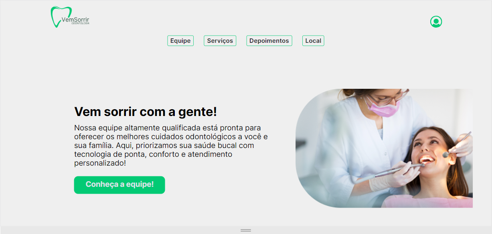

<h1 align="center"> vs12-front-VemSorrir </h1>

<p align="center">
  Site em HTML e CSS, desenvolvido a fim de cumprir com os objetivos da task 04 - Projeto final do módulo de HTML e CSS do VemSer, proposta pelo TechLead Rafael Ramos.<br/>
</p>

<p align="center">
  <a href="#-tecnologias">Tecnologias</a>&nbsp;&nbsp;&nbsp;|&nbsp;&nbsp;&nbsp;
  <a href="#-instalacao-do-projeto">Instalação do projeto</a>&nbsp;&nbsp;&nbsp;|&nbsp;&nbsp;&nbsp;
  <a href="#-sobre-o-projeto">Sobre o Projeto</a>&nbsp;&nbsp;&nbsp;
</p>

<p align="center">
  
</p>

## 🚀 Tecnologias

Esse projeto foi desenvolvido com as seguintes tecnologias:

- HTML 5
- CSS 3

## ⚙️ Instalação do projeto

Passo-a-passo:

1. Comandos necessários para executar:

```
no arquivo index.html, abrir com Live Server.

```

> O projeto é uma aplicação Web e deve ser visualizado em um navegador padrão.

## 💻 Sobre o Projeto

O projeto é uma aplicação de HTML e CSS, a fim de realizar a task 04 - Projeto final do módulo de HTML e CSS do VemSer. Fizemos uma página de uma Clínica Odontológica para demonstrar conhecimentos de transitions, media screen, tags HTML e outros conhecimentos pertinentes às linguagens HTML e CSS.
